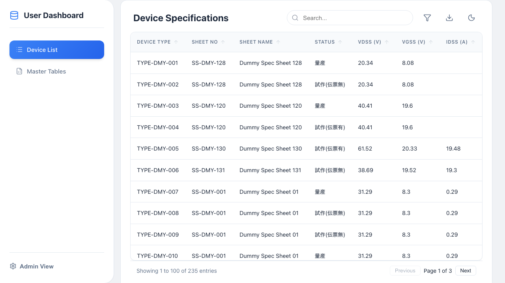
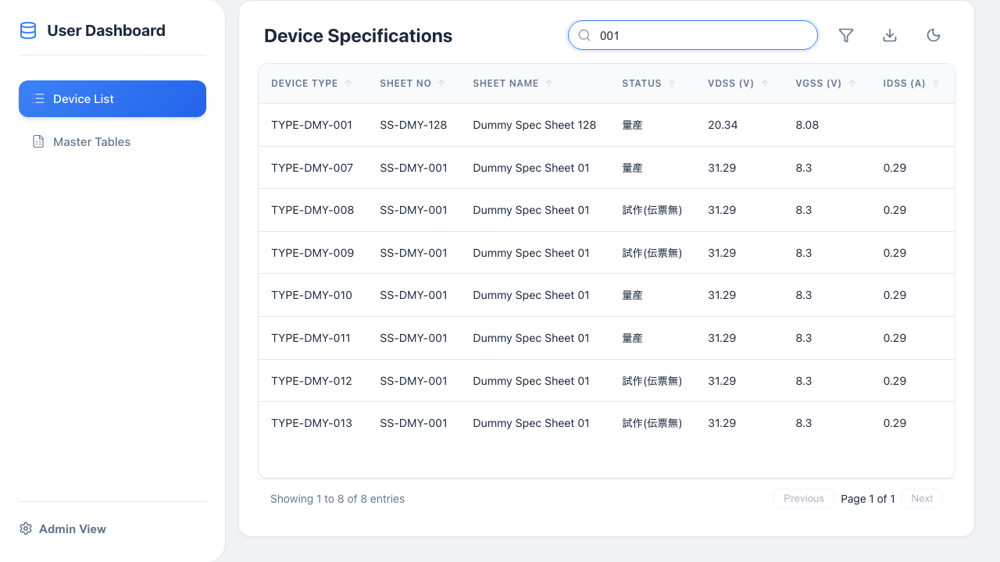
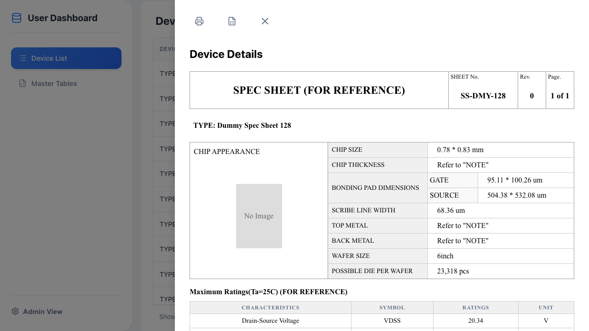
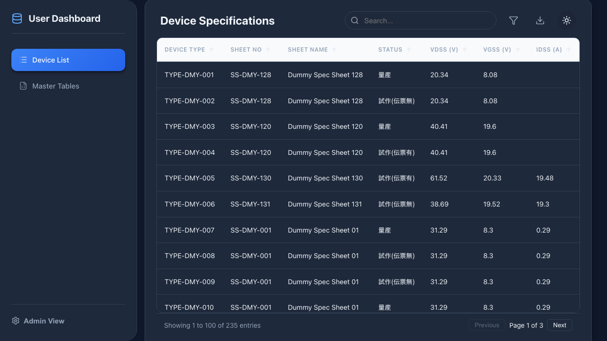
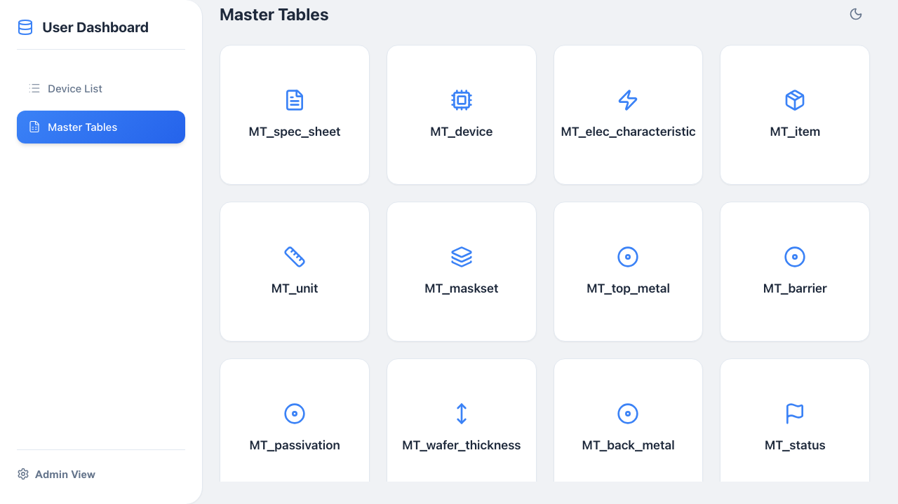

<!-- _class: lead -->

# SSManager
## (SpecSheet Manager)

### 半導体デバイススペックシート管理ツール

---

# 概要 (Overview)

**SSManager** は、Excelファイルで分散管理されがちな半導体デバイスのマスタデータを、Webブラウザ上で一元管理・活用するためのアプリケーションです。

- **課題**: Excelでの管理は検索性が低く、版管理や共有が煩雑。
- **解決**: データベース化による高速検索と、標準化されたUIでの閲覧・出力。

---

# 主な機能 (Key Features)

---

# 1. 高速検索 & フィルタリング

キーワード検索に加え、各カラムごとの詳細フィルタが可能。

---

# 2. 詳細ビュー (Detail Drawer)

一覧からワンクリックでスペックシート形式の詳細を表示。

---

# 3. Excel エクスポート

表示中のデータをそのままExcel形式でダウンロード。

---

# デモのハイライト

---

# ダークモード

環境に合わせた表示モードの切り替え。

---

# Master Tables

管理者向けのマスタデータ閲覧機能。

---

# 技術スタック (Tech Stack)

## Frontend
- **React**: ユーザーインターフェース構築
- **Vite**: 高速なビルドツール
- **Lucide React**: モダンなアイコンセット

## Backend
- **FastAPI**: 高速なPython Webフレームワーク
- **SQLAlchemy**: データベース操作 (ORM)
- **Pandas / OpenPyXL**: Excelデータ処理

---

# 今後の展望 (Roadmap)

- **編集機能の強化**: ブラウザ上での直接編集とバリデーション
- **認証機能**: ユーザー権限管理の導入
- **クラウド連携**: データのクラウド同期

---

<!-- _class: lead -->

# Thank You
